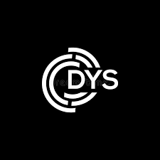
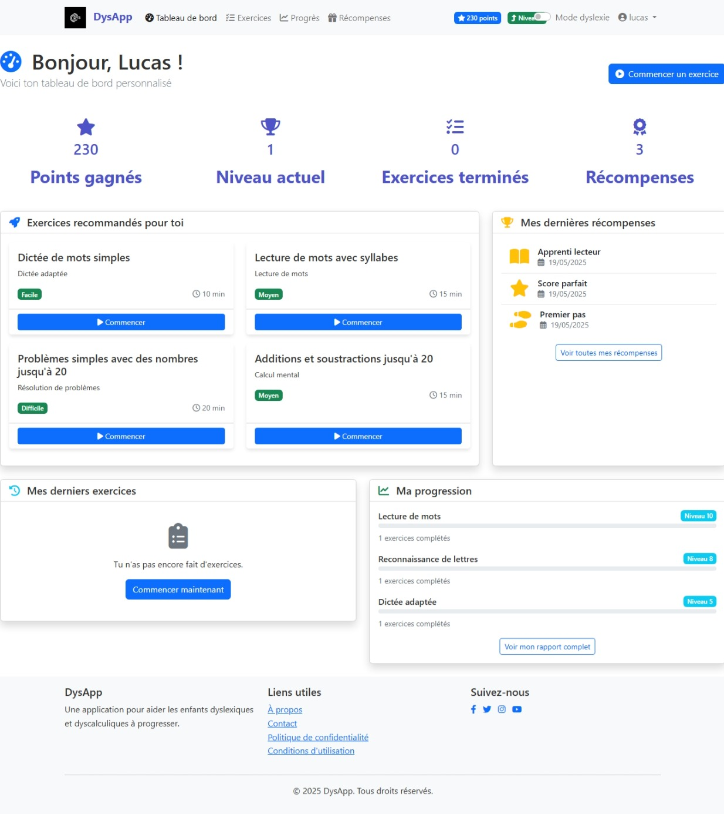
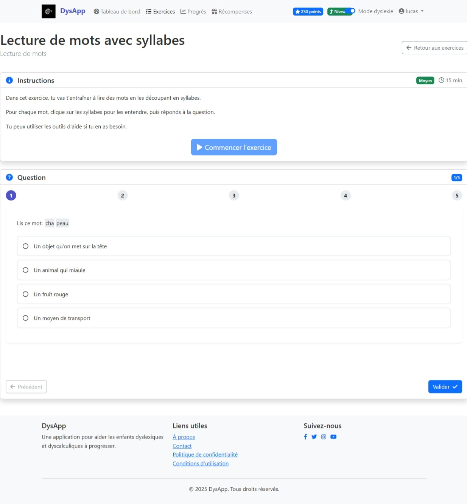
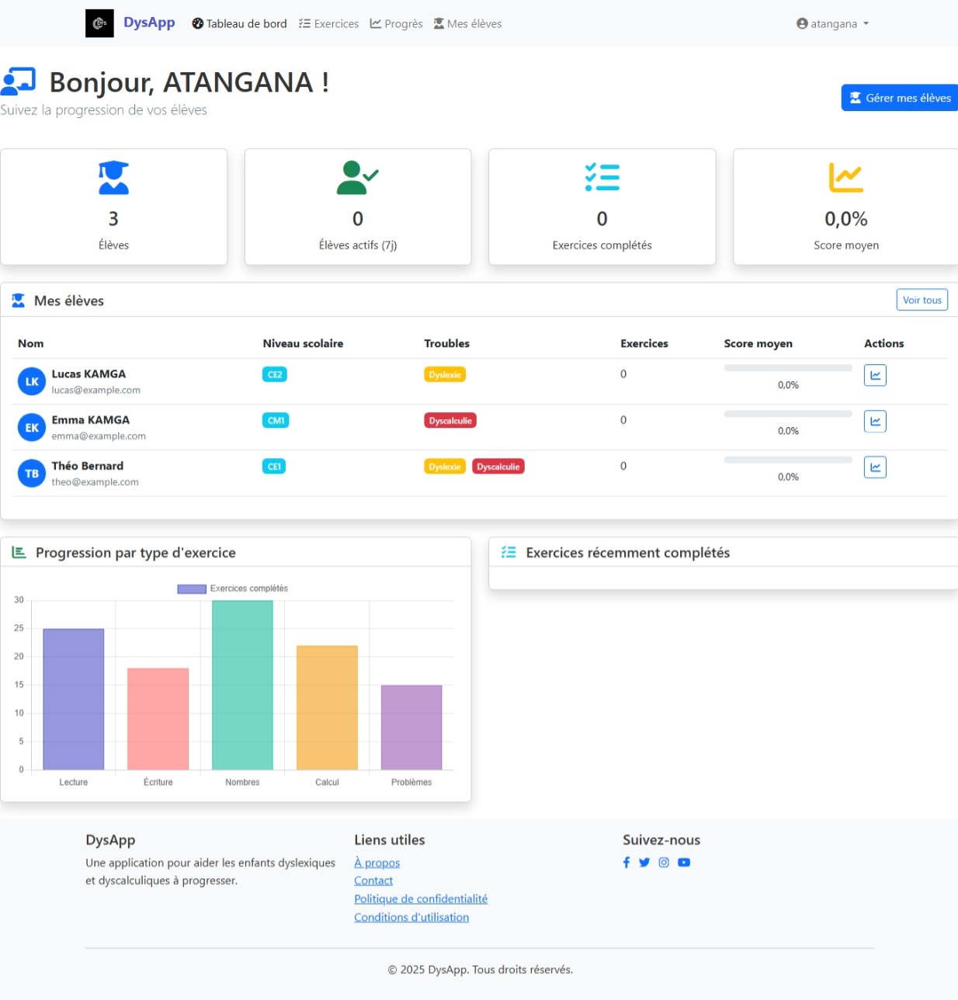
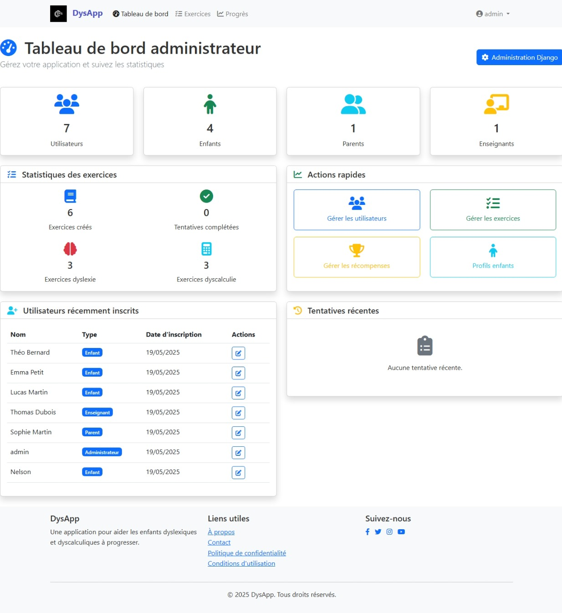

# Application pour Enfants Dyslexiques et Dyscalculiques

Une application web Django conçue pour aider les enfants atteints de dyslexie et de dyscalculie à améliorer leurs compétences en lecture, écriture et mathématiques à travers des exercices interactifs et adaptés.

## Caractéristiques

- **Exercices adaptés** : Exercices spécifiquement conçus pour les enfants dyslexiques et dyscalculiques
- **Profils personnalisés** : Adaptation au niveau et aux besoins spécifiques de chaque enfant
- **Système de récompenses** : Motivation par des récompenses et des badges
- **Suivi des progrès** : Tableaux de bord détaillés pour les enfants, parents et enseignants
- **Interface adaptée** : Design spécialement conçu pour faciliter la lecture et la navigation
- **Multi-utilisateurs** : Gestion des profils pour enfants, parents et enseignants

## Captures d'écran

## Technologies utilisées

- **Backend** : Django 4.0+, Python 3.8+
- **Frontend** : HTML5, CSS3, JavaScript, Bootstrap 5
- **Base de données** : PostgreSQL (production), SQLite (développement)
- **Déploiement** : Docker, Gunicorn, Nginx

## Installation

### Prérequis

- Python 3.8 ou supérieur
- pip (gestionnaire de paquets Python)
- Virtualenv (recommandé)

### Installation locale

1. Clonez le dépôt :
\`\`\`bash
git clone https://github.com/votre-organisation/dyslexia-dyscalculia-app.git
cd dyslexia-dyscalculia-app
\`\`\`

2. Créez et activez un environnement virtuel :
\`\`\`bash
python -m venv venv
source venv/bin/activate  # Sur Windows : venv\Scripts\activate
\`\`\`

3. Installez les dépendances :
\`\`\`bash
pip install -r requirements.txt
\`\`\`

4. Configurez les variables d'environnement :
\`\`\`bash
cp .env.example .env
# Modifiez le fichier .env avec vos propres paramètres
\`\`\`

5. Appliquez les migrations :
\`\`\`bash
python manage.py migrate
\`\`\`

6. Chargez les données de démonstration (optionnel) :
\`\`\`bash
python manage.py load_demo_data
\`\`\`

7. Lancez le serveur de développement :
\`\`\`bash
python manage.py runserver
\`\`\`

8. Accédez à l'application dans votre navigateur à l'adresse `http://localhost:8000`

### Installation avec Docker

1. Assurez-vous que Docker et Docker Compose sont installés
2. Clonez le dépôt :
\`\`\`bash
git clone https://github.com/votre-organisation/dyslexia-dyscalculia-app.git
cd dyslexia-dyscalculia-app
\`\`\`

3. Configurez les variables d'environnement :
\`\`\`bash
cp .env.example .env
# Modifiez le fichier .env avec vos propres paramètres
\`\`\`

4. Construisez et lancez les conteneurs :
\`\`\`bash
docker-compose up -d
\`\`\`

5. Accédez à l'application dans votre navigateur à l'adresse `http://localhost:8000`

## Utilisation

### Comptes de démonstration

Si vous avez chargé les données de démonstration, vous pouvez utiliser les comptes suivants :

- **Admin** : admin / admin123
- **Parent** : parent / parent123
- **Enseignant** : teacher / teacher123
- **Enfant** : child / child123

### Guide rapide

1. **Inscription** : Créez un compte parent, enseignant ou administrateur
2. **Profil enfant** : Ajoutez un profil enfant avec ses caractéristiques (niveau scolaire, type de trouble)
3. **Exercices** : Accédez aux exercices adaptés au profil de l'enfant
4. **Suivi** : Consultez les rapports de progression dans le tableau de bord

## Déploiement en production

Pour un déploiement en production, suivez ces étapes supplémentaires :

1. Configurez les paramètres de sécurité dans le fichier `.env` :
\`\`\`
DEBUG=False
SECRET_KEY=votre-clé-secrète-complexe
ALLOWED_HOSTS=votre-domaine.com
\`\`\`

2. Configurez un serveur web comme Nginx pour servir les fichiers statiques
3. Utilisez Gunicorn comme serveur WSGI
4. Configurez HTTPS avec Let's Encrypt
5. Mettez en place une sauvegarde régulière de la base de données

Consultez le fichier `deployment.md` pour des instructions détaillées.

## Contribution

Les contributions sont les bienvenues ! Veuillez consulter le fichier `CONTRIBUTING.md` pour les directives de contribution.

## Feuille de route

- [ ] Ajout d'exercices pour la dyspraxie
- [ ] Application mobile (iOS et Android)
- [ ] Intégration de la synthèse vocale
- [ ] Mode hors ligne
- [ ] Traduction en plusieurs langues
- [ ] API pour intégration avec d'autres outils éducatifs

## Licence

Ce projet est sous licence [MIT](LICENSE).

## Contact

Pour toute question ou suggestion, veuillez contacter l'équipe de développement à l'adresse support@dyslexia-app.com ou ouvrir une issue sur GitHub.

## Remerciements

- Tous les contributeurs du projet
- Les orthophonistes et spécialistes qui ont aidé à concevoir les exercices
- Les familles et enseignants qui ont participé aux tests
\`\`\`

## 15. Exemples de templates HTML

Ajoutons quelques exemples de templates HTML pour les principales pages de l'application.

